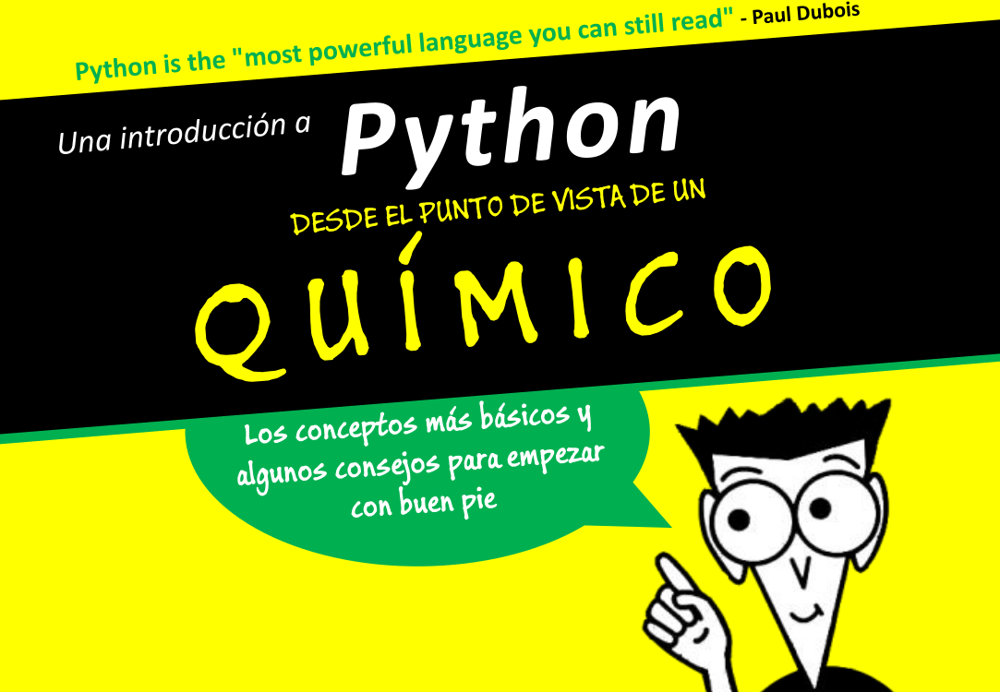

---

---

**Tenemos un problema de comunicación los ordenadores.**

Para nosotros,
**1 == '1'**

Para un ordenador,
**1 != '1'**

**Hace falta un lenguaje intermedio para comunicarnos --> programar**

---

**"El español para mis tropas, el francés para las mujeres, y el alemán para mi caballo."**

-- Carlos I de España [Wikiquote](https://es.wikiquote.org/wiki/Carlos_I_de_Espa%C3%B1a)

**Hay un lenguaje apropiado para cada propósito**

---

**Python** es:

- Fácil de entender.
- Rápido de programar.
- Muy potente (sirve para casi todo).
- Muy lento.

---

**Paso 1**: instalar python

Recomiendo *Anaconda*:

    &nbsp;&nbsp;&nbsp;&nbsp;[https://www.continuum.io/downloads](https://www.continuum.io/downloads)

- paquetes Python para Linux, Mac o Windows
- trae un montón de cosas útiles

---

**Paso 2**: elegir un editor

Recomiendo mucho *PyCharm*:
    
    &nbsp;&nbsp;&nbsp;&nbsp;[https://www.jetbrains.com/pycharm/download](https://www.jetbrains.com/pycharm/download)

- Soporta Mac, Win y Linux
- **Gratis**

---

**Paso 3**: saber cómo encontrar ayuda

- Google

    &nbsp;&nbsp;&nbsp;&nbsp;[https://www.google.com](https://www.google.com)

- Documentación de Python

    &nbsp;&nbsp;&nbsp;&nbsp;[https://docs.python.org/2/](https://docs.python.org/2/)

- Stack Overflow

    &nbsp;&nbsp;&nbsp;&nbsp;[https://stackoverflow.com/](https://stackoverflow.com/)

- El comodín de la llamada 

---

**Paso 4**: practicar y aprender sobre la marcha

- [https://es.coursera.org/learn/interactive-python-1](https://es.coursera.org/learn/interactive-python-1)
- [https://stepik.org/course/Adaptive-Python-568](https://stepik.org/course/Adaptive-Python-568)
